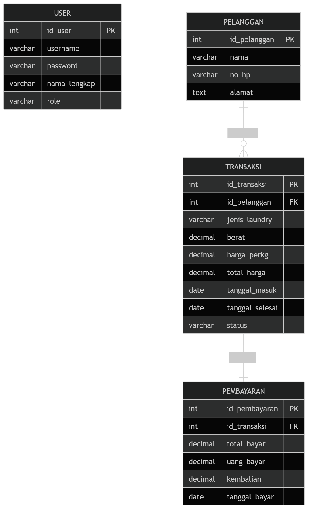
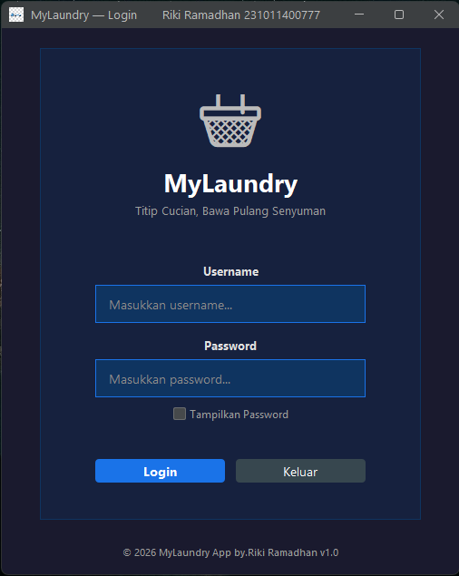
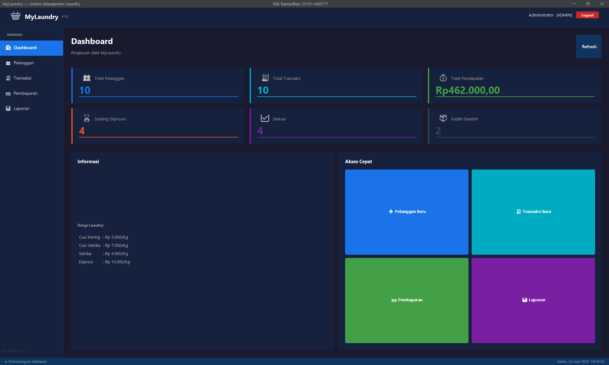
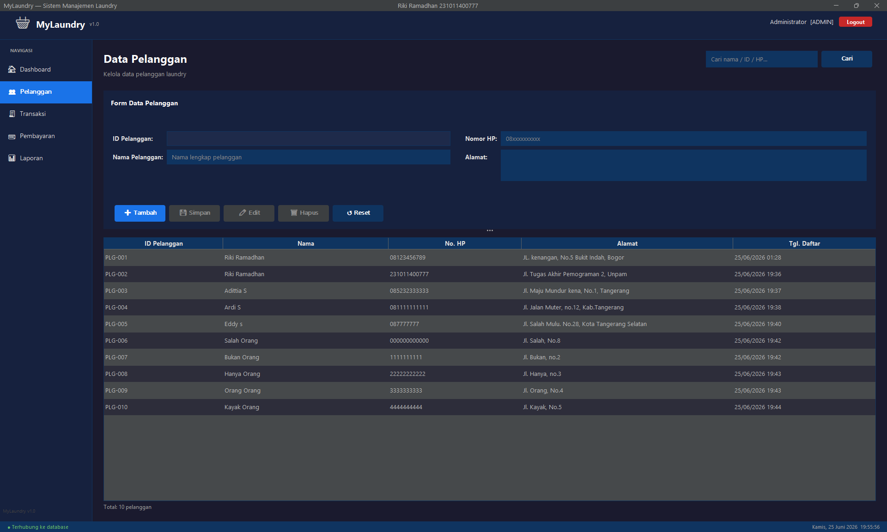
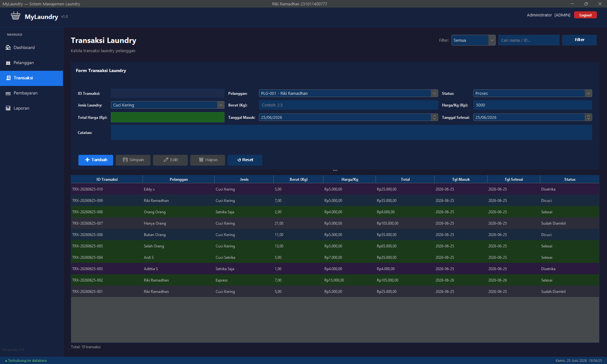
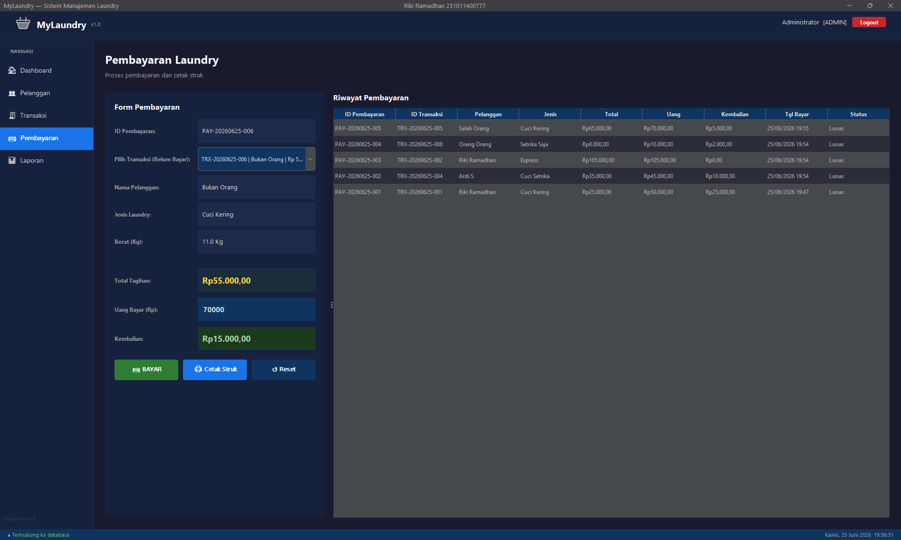
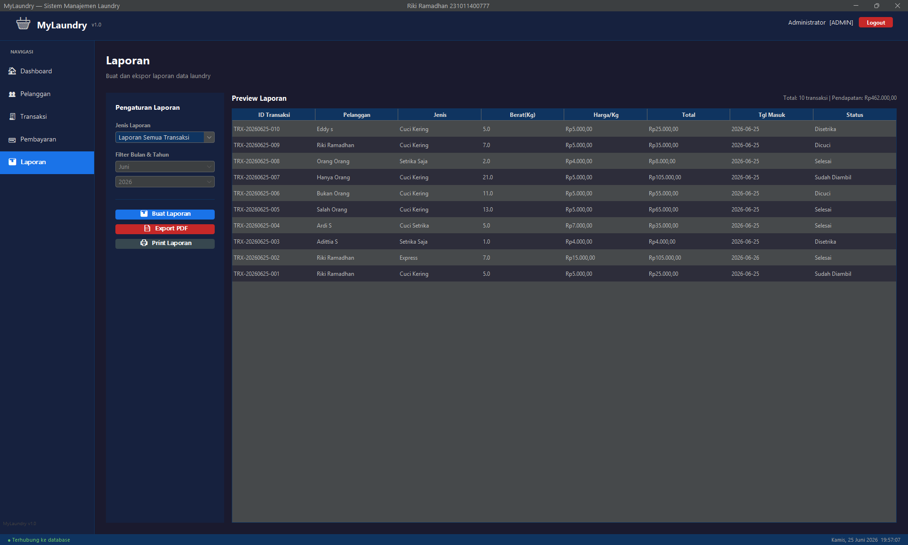

# MyLaundry — Sistem Manajemen Laundry

Identitas Mahasiswa

Nama   : Riki Ramadhan
NIM    : 231011400777
Object : Laundry
---

Aplikasi desktop **Java Swing** untuk manajemen laundry dengan arsitektur **MVC + DAO** dan database **MySQL**.

---

## Struktur Folder Project

```
MyLaundry/
├── pom.xml                          ← Maven dependencies
├── database/
│   └── db_laundry231011400777.sql                ← Script SQL database
├── src/
│   └── main/
│       ├── java/com/mylaundry/
│       │   ├── Main.java            ← Entry point
│       │   ├── config/
│       │   │   └── DBConnection.java
│       │   ├── model/
│       │   │   ├── User.java
│       │   │   ├── Pelanggan.java
│       │   │   ├── Transaksi.java
│       │   │   └── Pembayaran.java
│       │   ├── dao/
│       │   │   ├── UserDAO.java
│       │   │   ├── PelangganDAO.java
│       │   │   ├── TransaksiDAO.java
│       │   │   └── PembayaranDAO.java
│       │   ├── controller/
│       │   │   ├── AuthController.java
│       │   │   ├── PelangganController.java
│       │   │   ├── TransaksiController.java
│       │   │   └── PembayaranController.java
│       │   └── view/
│       │       ├── LoginFrame.java
│       │       ├── MainFrame.java
│       │       ├── DashboardPanel.java
│       │       ├── PelangganPanel.java
│       │       ├── TransaksiPanel.java
│       │       ├── PembayaranPanel.java
│       │       └── LaporanPanel.java
│       └── resources/
│           ├── db.properties        ← Konfigurasi database
│           └── reports/
│               ├── LaporanTransaksi.jrxml
│               └── LaporanPelanggan.jrxml
└── README.md
```

---

## Cara Setup & Menjalankan

### 1. Persiapan Database MySQL

```sql
-- Buka MySQL Workbench atau Command Line
-- Jalankan script SQL:
source database : db_laundry231011400777.sql;
```

Atau:
- Buka **phpMyAdmin** → Import → pilih file `database/db_laundry231011400777.sql`
- Pastikan database `database/db_laundry231011400777.sql` berhasil dibuat

### 2. Konfigurasi Koneksi Database

Edit file `src/main/resources/db.properties`:

```properties
db.url=jdbc:mysql://localhost:3306/db_laundry231011400777?useSSL=false&serverTimezone=Asia/Jakarta&allowPublicKeyRetrieval=true
db.username=root
db.password=        ← isi password MySQL Anda
```

### 3. Import Project ke NetBeans

1. Buka **NetBeans IDE**
2. Menu **File → Open Project**
3. Pilih file `AplikasiMyLaundry`
4. NetBeans akan mendeteksi sebagai **Maven Project**
5. Klik kanan project → **Build with Dependencies** (akan download semua JAR)

### 4. Jalankan Aplikasi

- Klik kanan project → **Run**  
  atau tekan `F6`

---

## Hak Akses

| Username | Password  | Role  |
|----------|-----------|-------|
| admin    | admin123  | Admin |
| kasir    | kasir123  | Kasir |

---

## Fitur Lengkap

### 1. Login
- Username & Password dengan MD5 hash
- Validasi via PreparedStatement
- Animasi shake jika salah

### 2. Dashboard
- Total pelanggan, transaksi, pendapatan
- Jumlah status laundry (Proses/Selesai/Diambil)
- Akses cepat ke semua modul

### 3. Data Pelanggan (CRUD)
- ID Auto-Generate (PLG-001, PLG-002, ...)
- Tambah, Simpan, Edit, Hapus, Reset
- Real-time search & filter
- Data tampil di JTable dengan sorting

### 4. Transaksi Laundry (CRUD)
- ID Auto-Generate (TRX-YYYYMMDD-001)
- Pilih pelanggan dari ComboBox
- Jenis: Cuci Kering | Cuci Setrika | Setrika Saja | Express
- **Total harga otomatis** = berat × harga/kg
- Harga default otomatis sesuai jenis laundry
- Filter status & pencarian real-time
- Warna baris tabel sesuai status

### 5. Pembayaran
- Pilih transaksi belum bayar dari ComboBox
- Auto-fill data transaksi
- **Kembalian otomatis** real-time
- Validasi: uang tidak boleh kurang dari tagihan
- Cetak struk menggunakan Java Print API

### 6. Laporan (JasperReports)
- Laporan Semua Transaksi
- Laporan Pendapatan per Bulan (filter bulan/tahun)
- Laporan Data Pelanggan
- Preview tabel langsung di aplikasi
- Export ke PDF
- Print langsung

---

## Teknologi

| Komponen | Versi |
|----------|-------|
| Java     | 11+   |
| MySQL    | 8.0   |
| JDBC     | mysql-connector-java 8.0.33 |
| Look & Feel | FlatDarkLaf 3.2.5 |
| Laporan  | JasperReports 6.21.0 |
| Build    | Maven |
| IDE      | NetBeans 17+ |

---

## Keyboard Shortcuts

| Shortcut | Fungsi |
|----------|--------|
| Alt+D    | Dashboard |
| Alt+P    | Data Pelanggan |
| Alt+T    | Transaksi |
| Alt+B    | Pembayaran |
| Alt+L    | Laporan |

---

## Entity Relationship Diagram (ERD)


---

## Database Schema

```
user         → id, username, password(MD5), nama_lengkap, role
pelanggan    → id_pelanggan(PLG-001), nama, no_hp, alamat
transaksi    → id_transaksi(TRX-YYYYMMDD-001), id_pelanggan(FK),
               jenis_laundry, berat, harga_per_kg, total_harga,
               tgl_masuk, tgl_selesai, status, catatan
pembayaran   → id_pembayaran(PAY-YYYYMMDD-001), id_transaksi(FK),
               total_bayar, uang_bayar, kembalian, tgl_bayar, status_bayar
```

---

## Screenshot Aplikasi
Login




Dashboard




Data Pelanggan




Transaksi Laundry




Pembayaran




Laporan




---

## Troubleshooting

**Error: Koneksi database gagal**
- Pastikan MySQL server sudah running
- Cek username/password di `db.properties`
- Pastikan database `mylaundry` sudah dibuat

**Error: Cannot find db.properties**
- Pastikan file ada di `src/main/resources/`
- Build project ulang (Clean and Build)

**Error: Driver MySQL tidak ditemukan**
- Jalankan **Build with Dependencies** di NetBeans
- Atau tambah dependency manual: `mysql-connector-java-8.0.33.jar`

**Laporan tidak tampil (JasperReports)**
- File `.jrxml` otomatis dikompilasi saat runtime
- Pastikan `jasperreports-6.21.0.jar` sudah ada di classpath

---

## Author

Riki Ramadhan
NIM : 231011400777
